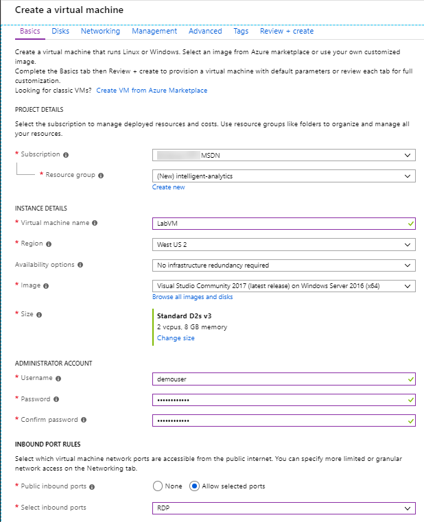
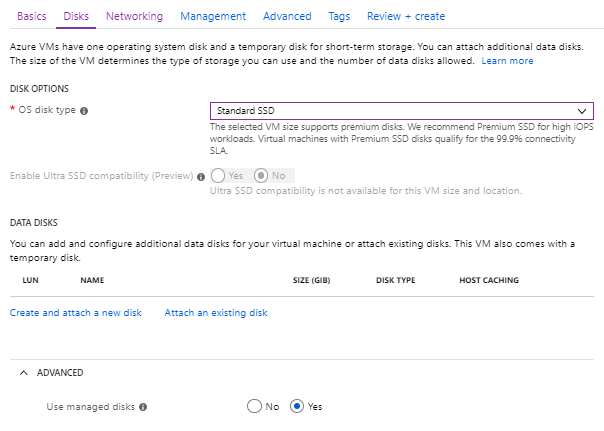
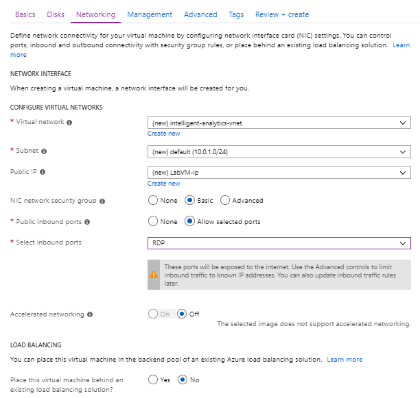

Intelligent analytics

Before the hands-on lab setup guide

April 2019

Information in this document, including URL and other Internet Web site references, is subject to change without notice. Unless otherwise noted, the example companies, organizations, products, domain names, e-mail addresses, logos, people, places, and events depicted herein are fictitious, and no association with any real company, organization, product, domain name, e-mail address, logo, person, place or event is intended or should be inferred. Complying with all applicable copyright laws is the responsibility of the user. Without limiting the rights under copyright, no part of this document may be reproduced, stored in or introduced into a retrieval system, or transmitted in any form or by any means (electronic, mechanical, photocopying, recording, or otherwise), or for any purpose, without the express written permission of Microsoft Corporation.

The names of manufacturers, products, or URLs are provided for informational purposes only and Microsoft makes no representations and warranties, either expressed, implied, or statutory, regarding these manufacturers or the use of the products with any Microsoft technologies. The inclusion of a manufacturer or product does not imply endorsement of Microsoft of the manufacturer or product. Links may be provided to third party sites. Such sites are not under the control of Microsoft and Microsoft is not responsible for the contents of any linked site or any link contained in a linked site, or any changes or updates to such sites. Microsoft is not responsible for webcasting or any other form of transmission received from any linked site. Microsoft is providing these links to you only as a convenience, and the inclusion of any link does not imply endorsement of Microsoft of the site or the products contained therein.

© 2019 Microsoft Corporation. All rights reserved.

Microsoft and the trademarks listed at <https://www.microsoft.com/legal/intellectualproperty/Trademarks/Usage/General.aspx> are trademarks of the Microsoft group of companies. All other trademarks are property of their respective owners.

**Contents**

<!-- TOC -->

- [Intelligent analytics before the hands-on lab setup guide](#intelligent-analytics-before-the-hands-on-lab-setup-guide)
  - [Requirements](#requirements)
  - [Before the hands-on lab](#before-the-hands-on-lab)
    - [Task: Setup a lab virtual machine](#task-setup-a-lab-virtual-machine)
<!-- /TOC -->

# Intelligent analytics before the hands-on lab setup guide

## Requirements

- Microsoft Azure subscription must be pay-as-you-go or MSDN.
  - Trial subscriptions will not work.
- A virtual machine configured with:
  - Visual Studio Community 2017 or greater, version 15.7 or later (<https://www.visualstudio.com/vs/>).  Use latest release.
  - Azure SDK 2.9 or later (Included with Visual Studio 2017).

## Before the hands-on lab

Duration: 20 minutes

Synopsis: In this exercise, you will set up your environment for use in the rest of the hands-on lab. You should follow all the steps provided in the Before the Hands-on Lab section to prepare your environment before attending the hands-on lab.

### Task: Setup a lab virtual machine 

1. In the [Azure Portal](https://portal.azure.com/), select +Create a resource, then type "Visual Studio" into the search bar. Select Visual Studio Community 2017 **(latest release)** on Windows Server 2016 (x64) from the results. 

")
 on Windows 2016 (x64) selected")

1. On the blade that comes up, ensure the deployment model is set to **Resource Manager**, and click the **Create** button.

2. Set the following configuration on the Basics tab:

    - **Subscription**: (Your Subscription) Select the subscription you are using for this hands-on lab.
    
    - **Resource Group**: Select Create new, and enter **intelligent-analytics** as the name of the new resource group.

    - **Virtual Machine Name**: Enter LabVM.

    - **Region**: Select a region close to you.

    - **Availability Options**:  Leave the availability option as **No infrastructure redundancy required**.

    - **Size**: Standard D2s v3

    - **Username**: demouser

    - **Password**: Password.1!!

    - **Public inbound ports**: Allow selected ports

    - **Select inbound ports**: Select **RDP**.

    - **Already have a Windows license?**: (Default)

    - **VM disk type**: Select **SSD**.

    

3. Select **Next: Disks** to move to the next step. 

    

4. OS Disk type: **Standard SSD**

5. Advanced - Use managed disks: **Yes**

    

6. Click **Next: Networking**

    

7. Leave defaults

    

8. Click the **Review + create** button.

    

9.  Azure will validate your settings.  If everything is valid, then click **Create**.

    

It may take 10+ minutes for the virtual machine to complete provisioning.

You should follow all steps provided *before* performing the Hands-on lab.
